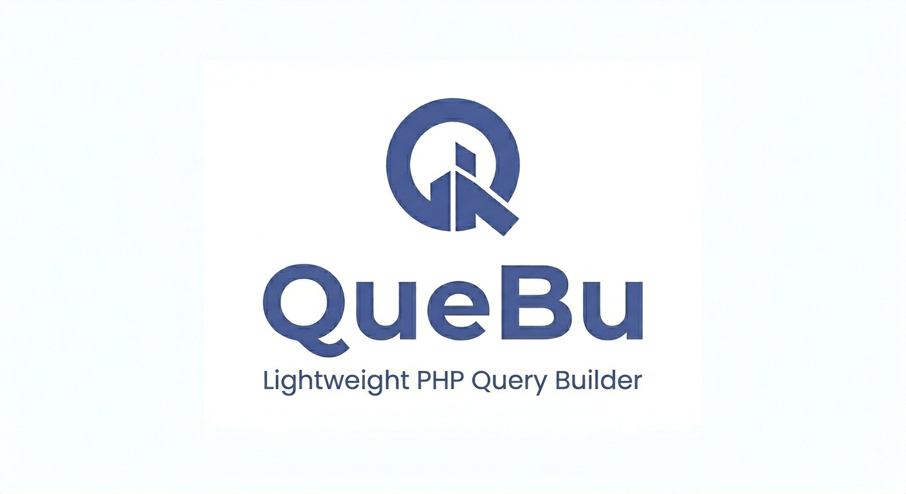

# QueBu - A Lightweight, Zero-Dependency PHP Query Builder



QueBu is a lightweight, dependency-free SQL query builder for PHP. It offers a clean, fluent API to build complex queries programmatically without the overhead of heavy ORMs.

### Why QueBu?
In many scenarios, such as micro-tools, CLI scripts, or legacy shared hosting, installing a full-blown ORM is often overkill or technically impossible. QueBu bridges this gap by providing:

- **Zero Dependencies for Production:** No `vendor` bloat. Pure, optimized PHP.
- **Standalone Autoloader:** Works out-of-the-box in restricted environments without Composer.
- **Security First:** Automatically uses prepared statements to prevent SQL Injection.
- **Minimal Memory Footprint:** Built for performance in resource-constrained environments.

---

### Installation and Usage

This is the primary, zero-dependency method for using QueBu in any project.

1.  Copy the `src` directory and the `autoload.php` file into your application.
2.  Include the custom autoloader and start building queries.
3.  Copy `.env.example` to `.env` to create your local environment file:
    ```bash
    cp .env.example .env
    ```
4.  Edit `.env` and set your database credentials (`DB_HOST`, `DB_PORT`, `DB_DATABASE`, `DB_USERNAME`, `DB_PASSWORD`, etc.).
5.  Never commit `.env` to the repository. Keep it only in your local environment.
6.  If you deploy the project, prefer placing `.env` outside the web root (for example, outside `public_html` on cPanel) and pass that path to `EnvLoader::load(...)`. The loader hydrates QueBu's internal environment resolver without writing to PHP superglobals.

```php
<?php
require __DIR__ . '/autoload.php';

use Pindinelli\Quebu\DB;
use Pindinelli\Quebu\DatabaseConfig;
use Pindinelli\Quebu\EnvLoader;
use Pindinelli\Quebu\Enums\Operators;

// 1. Load environment variables from a .env file into the internal resolver
EnvLoader::load(__DIR__);

// 2. Build the database config from the environment
$config = DatabaseConfig::fromEnvironment();

// 3. Connect to the database
DB::connect($config->dsn, $config->user, $config->password);

// 4. Start building queries!
$items = DB::from('test_items')
    ->andWhere('value', Operators::GREATER_THAN, 75)
    ->orderBy('name')
    ->get();

print_r($items);
```

#### Composer Note

QueBu is currently intended to be used locally (copy `src/` + `autoload.php`) and is **not published on Packagist**.

If your application already uses Composer, you can still include QueBu manually and keep using Composer for the rest of your app dependencies.

---

### API Examples

**SELECT with a JOIN**
```php
$items = DB::from('test_items')
    ->select('test_items.name as item_name', 'categories.name as category_name')
    ->join('categories', 'test_items.category_id', 'categories.id')
    ->limit(5)
    ->get();
```

**INSERT, UPDATE, and DELETE**
```php
$newId = DB::from('test_items')->insert([
    'name' => 'Demo Item',
    'description' => 'Created by QueBu',
    'value' => 120,
    'category_id' => 1,
]);

DB::from('test_items')->andWhere('id', Operators::EQUAL, $newId)->update([
    'name' => 'Demo Item Updated',
]);

DB::from('test_items')->andWhere('id', Operators::EQUAL, $newId)->delete();
```

---

### Development and Testing

While the library itself has no production dependencies, **Composer is used for development** to manage testing tools like PHPUnit.

To contribute or run the tests locally:

1.  **Clone the repository** and navigate into the directory.
2.  **Install development dependencies:** `composer install`
3.  **Run the test suite:** `composer test`